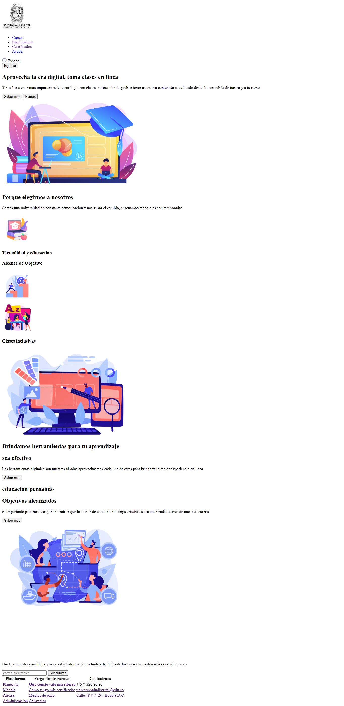

<h1>Taller 9 Nelson Javier Lopez Sanabria</h1>

<h2> Información</h2>

Curso: full Stack Basico - Grupo 1

Profesor: Cristian Patiño

<h2> Punto 1: Link figma</h2>

<a href="" target="_blank">Link de Figma</a>
<h2> Punto 2: HTML</h2>

